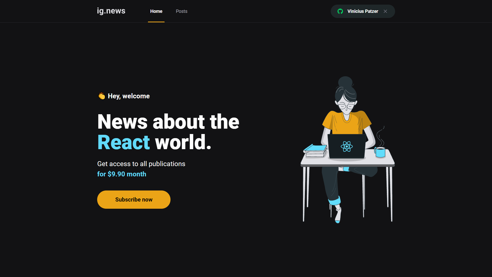
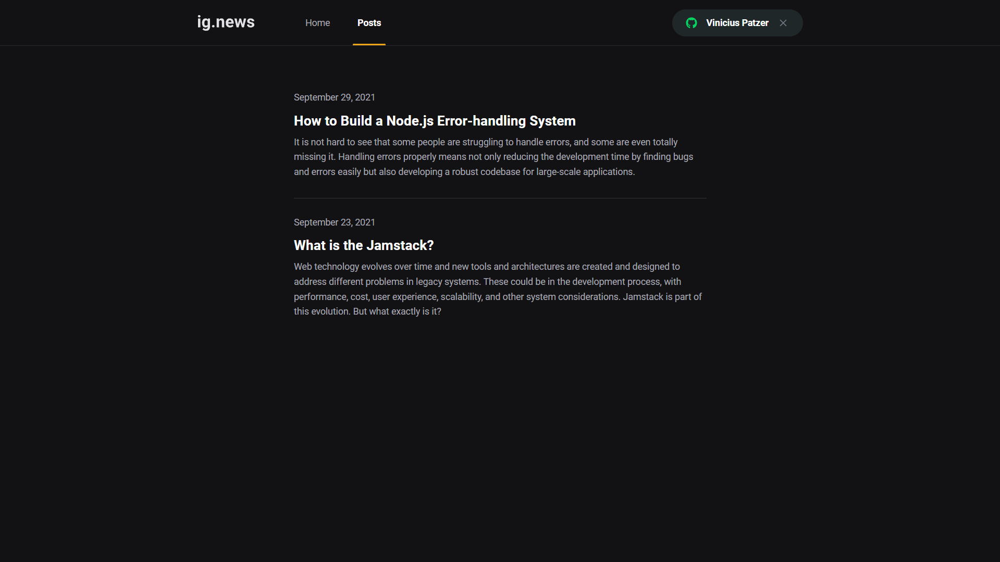
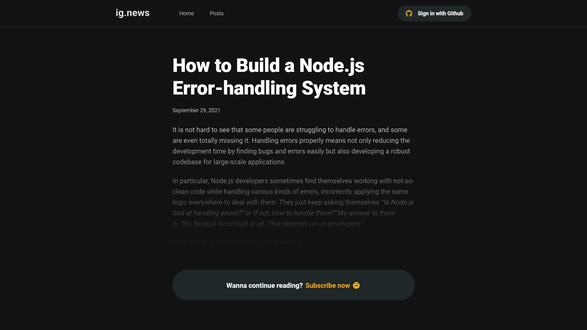
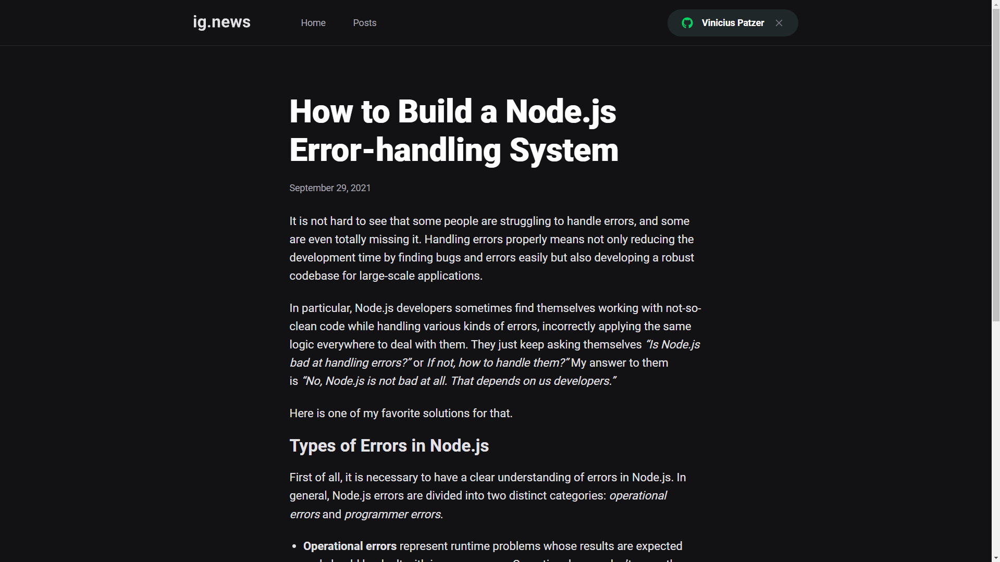

<div align="center"> 
  
</div>

<br>

<div align="center"> 
  

  ---

  
  
  ---

  
  
  ---

  
</div>

<!-- ### [Demo](https://xxxxx-viniciuspatzer.netlify.app/) -->

## About

A amazing articles subscription app built using React and NextJS, where the people who are not subscribed can only view the preview post, the articles can be posted through Prismic which is a Content Manager System (CMS).

## Technologies

The following tools were used in this project:

- [React](https://pt-br.reactjs.org/)
- [TypeScript](https://www.typescriptlang.org/)
- [Sass](https://sass-lang.com/)
- [Next.js](https://nextjs.org/)
- [FaunaDB](https://fauna.com/)
- [Prismic CMS](https://prismic.io/)
- [Stripe API](https://stripe.com/docs/api)
- [NextAuth.js](https://next-auth.js.org/)

## Getting started

You will need to have [Git](https://git-scm.com) and [Node](https://nodejs.org/en/) installed.

```bash
# Clone this project
$ git clone https://github.com/viniciuspatzer/ig.news.git

# Access
$ cd ig.news

# Install dependencies
$ yarn install

# Run the project
$ yarn start

# The server will initialize on the localhost
```
